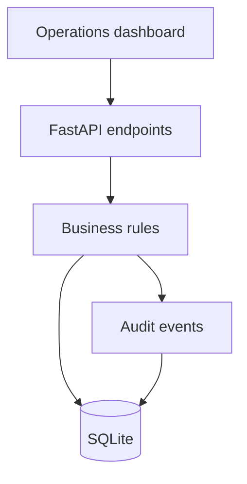

# SaaS Implementation Operations Lab

[](https://github.com/Jsantiagom11/saas-implementation-ops-lab/actions/workflows/quality.yml)


An executable portfolio case study that models the operational control plane behind a SaaS implementation: customer onboarding, governed stage transitions, delivery metrics and an immutable audit trail.

## Why this exists

Implementation teams often manage critical delivery state across spreadsheets, chat and CRM notes. This project demonstrates how to turn that fragmented workflow into a small, auditable product with explicit business rules.

## Capabilities

- Customer implementation pipeline from discovery to hypercare
- Guarded transitions that prevent skipped delivery gates
- SQLite persistence with transactions and foreign keys
- Audit history for operational accountability
- Portfolio and adoption dashboard
- Responsive, dependency-free web interface
- Typed API contracts and automated lifecycle tests

## Architecture



The separation between HTTP routes, domain service and persistence keeps the business rules testable and makes a future PostgreSQL or CRM integration straightforward.

## Run locally

Requires Python 3.11+.

```bash
python -m venv .venv
source .venv/bin/activate
python -m pip install -e '.[dev]'
uvicorn saas_ops.main:app --reload
```

Open `http://127.0.0.1:8000`. Interactive API documentation is available at `/docs`.

Create the first implementation:

```bash
curl -X POST http://127.0.0.1:8000/api/customers \
  -H 'content-type: application/json' \
  -d '{"name":"Andes Telecom","owner":"Jorge Santiago","target_go_live":"2026-10-01T12:00:00Z","contract_value":48000}'
```

## Quality gates

```bash
make check
```

This runs Ruff, strict mypy and pytest. No credentials or external services are needed.

## Decisions and trade-offs

| Decision | Rationale | Production evolution |
|---|---|---|
| SQLite | Zero-friction local evaluation | PostgreSQL + migrations |
| Sequential stages | Makes governance visible | Configurable workflows |
| Synchronous API | Appropriate for current workload | Task queue for imports |
| Vanilla dashboard | Keeps the case inspectable | Component UI if scope grows |

## Roadmap

- CSV data-import validation and error reports
- Configurable SLAs and automated risk scoring
- Role-based access control
- Webhooks for CRM and messaging integrations
- OpenTelemetry metrics and structured logs

See [CHANGELOG.md](CHANGELOG.md) for released capabilities and evolution.

## Professional context

Built as a product-engineering case study at the intersection of SaaS implementation, operational delivery, workflow automation and troubleshooting.
